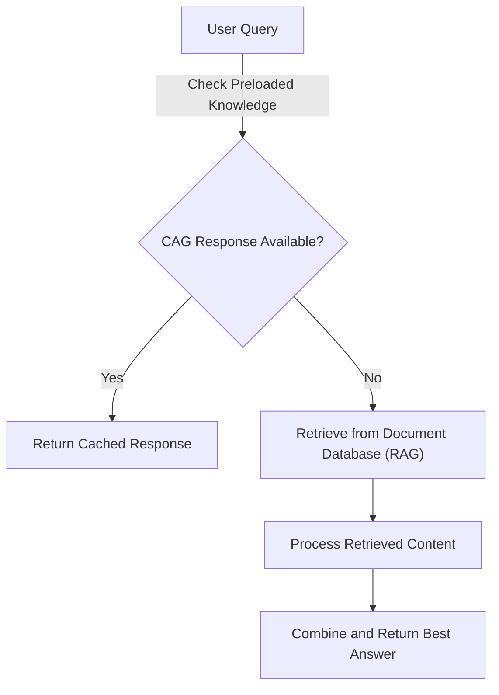

# Hybrid AI Chatbot (CAG + RAG)

## 🚀 Overview
This project implements a **Hybrid AI Chatbot** that combines **Cache-Augmented Generation (CAG)** and **Retrieval-Augmented Generation (RAG)** to provide a **fast, accurate, and real-time AI-powered response system**. 

### 🔍 Why Hybrid?
Traditional AI chatbots face **two major limitations**:
1️⃣ **CAG (Only Preloaded Knowledge)** → Fast but lacks real-time updates. ❌
2️⃣ **RAG (Retrieves Live Data)** → Up-to-date but slower responses. ❌

By integrating **both approaches**, we achieve:
✔ **Fast responses for common queries (CAG)**.
✔ **Real-time retrieval when needed (RAG)**.
✔ **Optimal AI performance using a balanced hybrid approach**.

---

## ✅ Use Cases
### 1️⃣ Customer Support Chatbots
- **CAG:** Answer FAQs instantly (e.g., refund policy, contact details).
- **RAG:** Retrieve updated customer service documentation.

### 2️⃣ Healthcare AI Assistants
- **CAG:** Common medical inquiries (e.g., flu symptoms).
- **RAG:** Fetch latest research papers or treatment guidelines.

### 3️⃣ Legal Research AI
- **CAG:** Basic legal terms and definitions.
- **RAG:** Retrieve real-time case laws or policy changes.

### 4️⃣ Academic Research Chatbots
- **CAG:** Common textbook knowledge.
- **RAG:** Fetch latest publications or papers.

---

## 🏆 Why is Hybrid AI Better?

| **Factor**        | **CAG Only** ❌ | **RAG Only** ❌ | **Hybrid (CAG+RAG) ✅** |
|------------------|-----------------|-----------------|-------------------------|
| 🔄 **Response Speed** | ⚡ Fast | ⏳ Slow (fetching data) | ⚡ Fast (CAG) + 🧠 Smart Search (RAG) |
| 🔍 **Knowledge Freshness** | 🏛 Static | ✅ Always fresh | ✅ Cached + Real-time |
| 📡 **Internet Requirement** | ❌ Not needed | ✅ Needs external data | ✅ Uses both |
| 🎯 **Best For** | FAQs, predefined data | Real-time, evolving knowledge | Both static & real-time info |
| 🏆 **Final Verdict** | ❌ Limited use | ❌ Slower & complex | ✅ Best of both worlds! |

📌 **Hybrid AI ensures** **low-latency responses** while allowing **real-time updates when necessary**. 

---

## 📌 How It Works: Flowchart



### 🔄 **Step-by-Step Process**
1️⃣ **User sends a query.**  

2️⃣ **Check CAG:**
   - If the answer is found in **preloaded memory**, return it instantly.
   - If **not found**, proceed to retrieval (RAG).

3️⃣ **Check RAG:**
   - Retrieve relevant documents from the **vector database**.
   - Process and combine **retrieved content**.
     
4️⃣ **Return the best possible answer** (CAG or RAG).

---

## 🚀 System Architecture
1️⃣ **Preloaded Knowledge Base (CAG)** → Stores common questions and responses in JSON.  
2️⃣ **Vector Database (RAG)** → Stores document embeddings for real-time retrieval.  
3️⃣ **AI Model** → Uses **both CAG & RAG** to generate final responses.  
4️⃣ **Streamlit UI** → Allows users to interact with the chatbot and switch between CAG, RAG, and Hybrid modes.

---

## 📌 Features
✅ **Hybrid Response Generation** (CAG for speed + RAG for accuracy)
✅ **Preloaded Knowledge for Fast Responses**
✅ **Document Retrieval for Up-to-Date Information**
✅ **Dynamic Response Switching** (Users can choose CAG, RAG, or Hybrid Mode)
✅ **User-Friendly Interface** (Streamlit UI)

---

## 💡 Future Improvements
🔹 **Multi-LLM Support** (OpenAI GPT + Ollama)  
🔹 **Improved Search Optimization** (Better ranking for document retrieval)  
🔹 **Contextual Memory** (AI remembers user preferences)  
🔹 **Multi-Language Support** (Enable responses in multiple languages)  

---

## 🚀 Getting Started
### **1️⃣ Clone the Repository**
```bash
 git clone git@github.com:YOUR_GITHUB_USERNAME/hybrid-chatbot.git
 cd hybrid-chatbot
```

### **2️⃣ Install Dependencies**
```bash
python3 -m venv venv
source venv/bin/activate  # Mac/Linux
# On Windows: venv\Scripts\activate
pip install openai chromadb streamlit fastapi langchain ollama
```

### **3️⃣ Run the Chatbot**
```bash
streamlit run app.py
```

This will launch the **web UI** where users can:
✅ Choose between **CAG, RAG, or Hybrid mode**  
✅ Ask questions & get **AI-powered responses**  

---

## 📌 Conclusion
**Hybrid AI Chatbots** **solve the key challenges** of **speed, accuracy, and real-time knowledge retrieval**. This approach is perfect for **customer service, healthcare, research, and legal domains.** 

📢 **Star this repo if you find it useful! 🚀**

